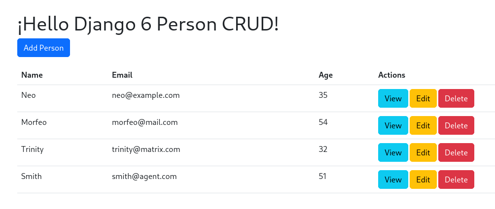
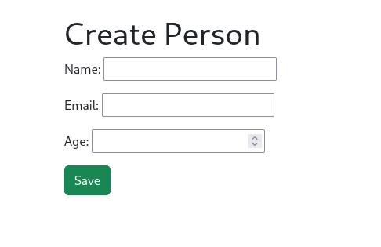
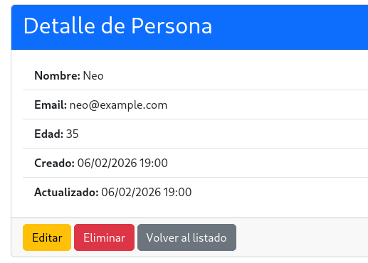

# Django 6 CRUD Example + Bootstrap 5

The following is an example of CRUD (Create, Read, Update, Delete) in Django 6.

## Requirements:
```
Django==6.0.2
Python>=3.12
```

## Run the following commands in sequence to deploy the project to a development environment:

```bash
Creating a Python 3 virtual environment:

1. Update the package list:

$ sudo apt update

2. Install python3-venv

$ sudo apt install python3-venv

3. Create the virtual environment:

$ python3 -m venv my_environment

4. Activate the environment:

$ source my_environment/bin/activate
```

Now install de Requirements

```bash
$ pip install -r requirements.txt

$ cp Django_6_crud/settings.py_example Django_6_crud/settings.py

$ python manage.py makemigrations

$ python manage.py migrate

$ python manage.py runserver
```

## Test the project:

Open your browser to http://127.0.0.1:8000 and you'll see the Django 6 CRUD
application for managing people records.

## Image








