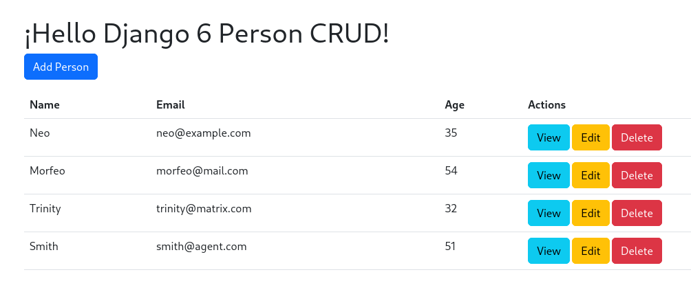
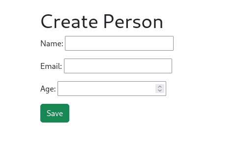
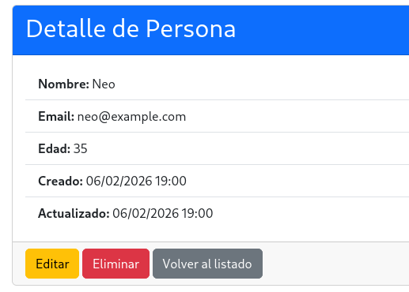
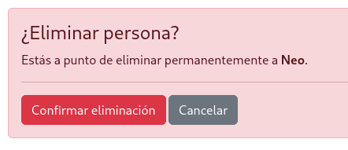

# Django 6 CRUD Example + Bootstrap 5

The following is an example of CRUD (Create, Read, Update, Delete) in Django 6.

There are 2 CRUD applications, one uses function-based views (FBV) and the other
uses class-based views (CBV).

## Requirements:
```
Django==6.0.2
Python>=3.12
```

## Run the following commands in sequence to deploy the project to a development environment:

```bash
Creating a Python 3 virtual environment:

1. Update the package list:

$ sudo apt update

2. Install python3-venv

$ sudo apt install python3-venv

3. Create the virtual environment:

$ python3 -m venv my_environment

4. Activate the environment:

$ source my_environment/bin/activate
```

Now install de Requirements

```bash
$ pip install -r requirements.txt

$ cp Django_6_crud/settings.py_example Django_6_crud/settings.py

$ python manage.py makemigrations person product

$ python manage.py migrate

$ python manage.py runserver
```

## Test the project:

Open your browser to http://127.0.0.1:8000 and you'll see the Django 6 CRUD
application for managing people records.

## Image









## Notificaciones por correo

Para el correcto funcionamiento de las notificaciones del sistema mediante la gestión de correo electrónico, se deben establecer los valores necesarios del servidor de correo a utilizar por la aplicación. Estas variables son:

```bash
EMAIL_BACKEND
DEFAULT_FROM_EMAIL
NOTIFY_EMAIL
EMAIL_HOST
EMAIL_PORT
EMAIL_HOST_USER
EMAIL_HOST_PASSWORD
EMAIL_USE_TLS
```

Donde:

Variable | Descripción | Ejemplo de Valor |
| :--- | :--- | :--- |
| **`EMAIL_BACKEND`** | Define el motor encargado de enviar los correos. Se cambia según el entorno (desarrollo o producción). | `'django.core.mail.backends.smtp.EmailBackend'` |
| **`DEFAULT_FROM_EMAIL`** | La dirección de correo que aparecerá como remitente por defecto en los envíos automáticos. | `'Soporte <soporte@tuapp.com>'` |
| **`NOTIFY_EMAIL`** | Variable personalizada (no estándar de Django) usada generalmente para definir quién recibe alertas administrativas. | `'admin@tuapp.com'` |
| **`EMAIL_HOST`** | La dirección del servidor SMTP de tu proveedor de correo. | `'smtp.gmail.com'` |
| **`EMAIL_PORT`** | El puerto que utiliza el servidor SMTP para la conexión. | `587` (TLS) o `465` (SSL) |
| **`EMAIL_HOST_USER`** | El nombre de usuario (usualmente el correo electrónico) para autenticarse en el servidor SMTP. | `'usuario@dominio.com'` |
| **`EMAIL_HOST_PASSWORD`** | La contraseña o token de aplicación para la cuenta de correo. **(Mantener en secreto)**. | `'abcd-1234-efgh-5678'` |
| **`EMAIL_USE_TLS`** | Booleano que indica si se debe usar una conexión segura TLS (Transport Layer Security). | `True` |

Para probar el funcionamiento de las notificaciones por correo y la correcta configuración en las variables descritas se recomienda ejecutar algunas instrucciones en la consola para lo cual se debe ejecutar el comando:

### 1. Acceder al Shell de Django
Asegúrate de estar en el directorio raíz de tu proyecto (donde reside `manage.py`) y con tu entorno virtual activo:

```bash
python manage.py shell
```
### 2. Importar Dependencias
Una vez dentro del intérprete (>>>), importa las herramientas necesarias de Django:

```bash
from django.core.mail import send_mail
from django.conf import settings
```

### 3. Ejecutar el Envío de Prueba
Utiliza la función send_mail. Si la configuración es correcta, la consola devolverá un 1 (indicando que 1 mensaje fue enviado con éxito).

```bash
send_mail(
    subject='Prueba de Notificación Django',
    message='Este es un mensaje de prueba enviado desde la consola de Python.',
    from_email=settings.DEFAULT_FROM_EMAIL,
    recipient_list=[settings.NOTIFY_EMAIL], # O usa una lista manual: ['tu@correo.com']
    fail_silently=False,
)
```

** Nota **: Se recomienda usar el modo consola para ver los resultados más comodamente configurando la variable de entorno EMAIL_BACKEND a **django.core.mail.backends.console.EmailBackend**