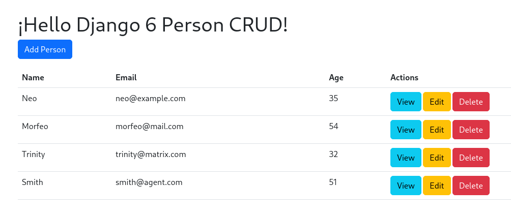
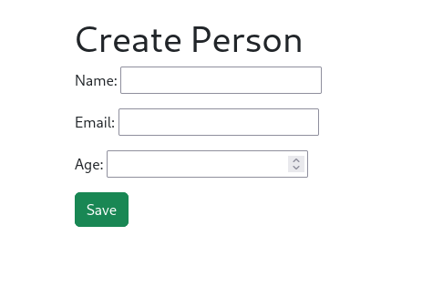
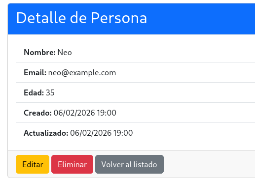
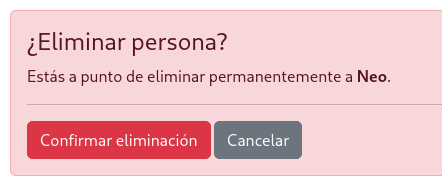

# Django 6 CRUD Example + Bootstrap 5

The following is an example of CRUD (Create, Read, Update, Delete) in Django 6.

There are 2 CRUD applications, one uses function-based views (FBV) and the other
uses class-based views (CBV).

## Requirements:
```
Django==6.0.2
Python>=3.12
```

## Run the following commands in sequence to deploy the project to a development environment:

```bash
Creating a Python 3 virtual environment:

1. Update the package list:

$ sudo apt update

2. Install python3-venv

$ sudo apt install python3-venv

3. Create the virtual environment:

$ python3 -m venv my_environment

4. Activate the environment:

$ source my_environment/bin/activate
```

Now install de Requirements

```bash
$ pip install -r requirements.txt

$ cp Django_6_crud/settings.py_example Django_6_crud/settings.py

$ python manage.py makemigrations person product

$ python manage.py migrate

$ python manage.py runserver
```

## Test the project:

Open your browser to http://127.0.0.1:8000 and you'll see the Django 6 CRUD
application for managing people records.

## Image









## Almacenamiento de archivos

Para el correcto funcionamiento del almacenamiento de archivos, se deben establecer los valores necesarios para la ubicación del directorio de archivos a utilizar por la aplicación. Estas variables son:

```bash
MEDIA_URL
MEDIA_ROOT
```

Donde:

Variable | Descripción | Ejemplo de Valor |
| :--- | :--- | :--- |
| **`MEDIA_URL`** | Ruta absoluta en el sistema de archivos donde se guardarán los archivos | `'storage/` |
| **`MEDIA_ROOT`** | URL pública para acceder a esos archivos desde el navegador | `os.path.join(BASE_DIR, 'storage')` |

*Nota*: Para que estos archivos sean visibles durante el desarrollo, añade esto a tu urls.py principal

```bash
if settings DEBUG:
    urlpatterns += static(settings.MEDIA_URL, document_root=settings.MEDIA_ROOT)
```